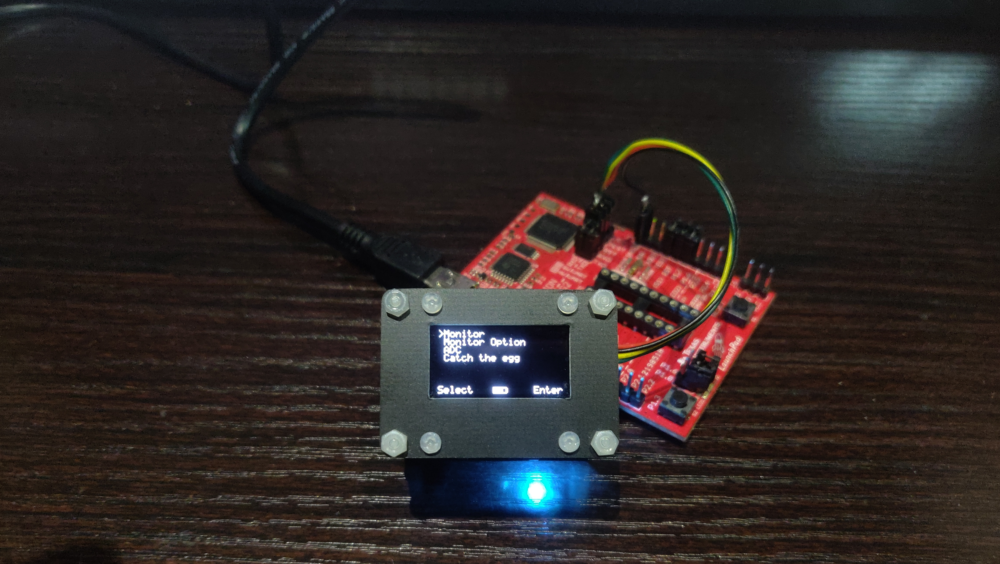
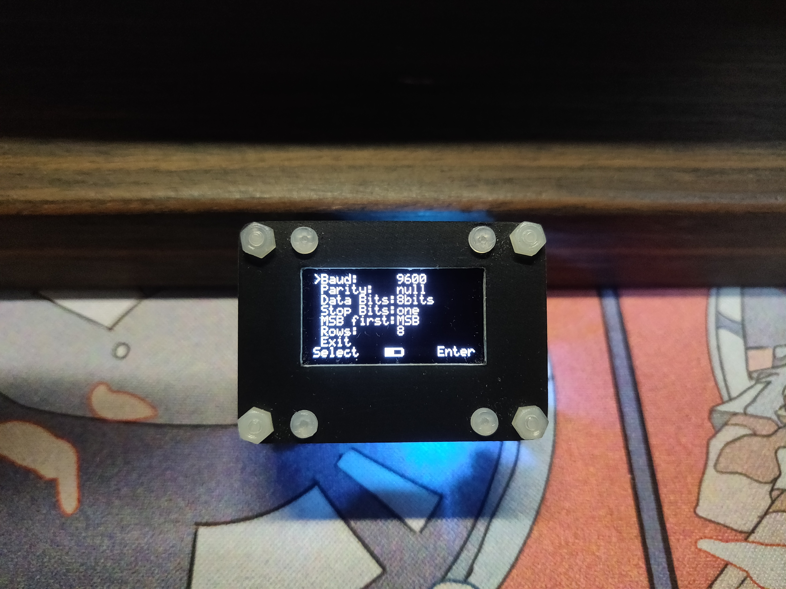
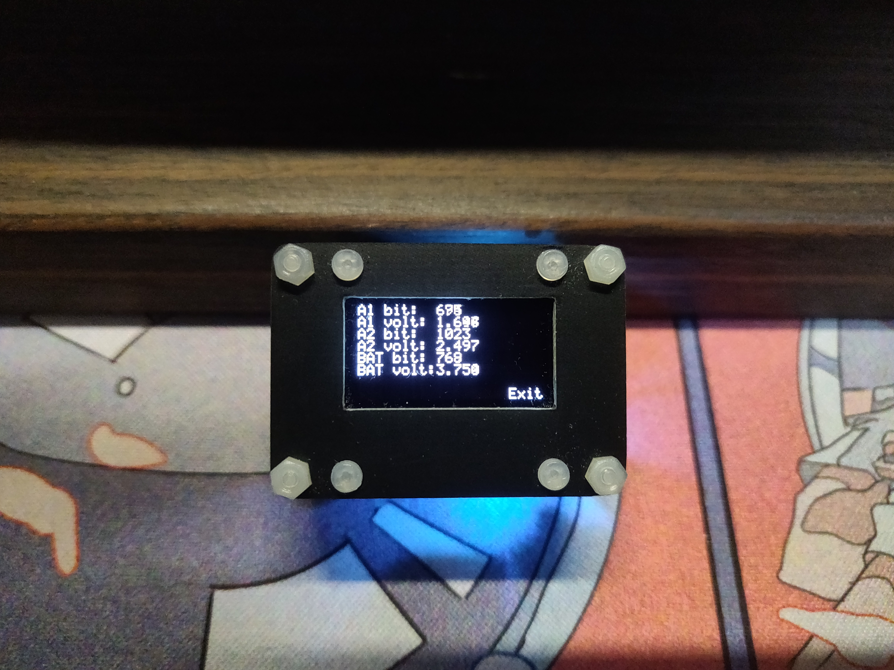
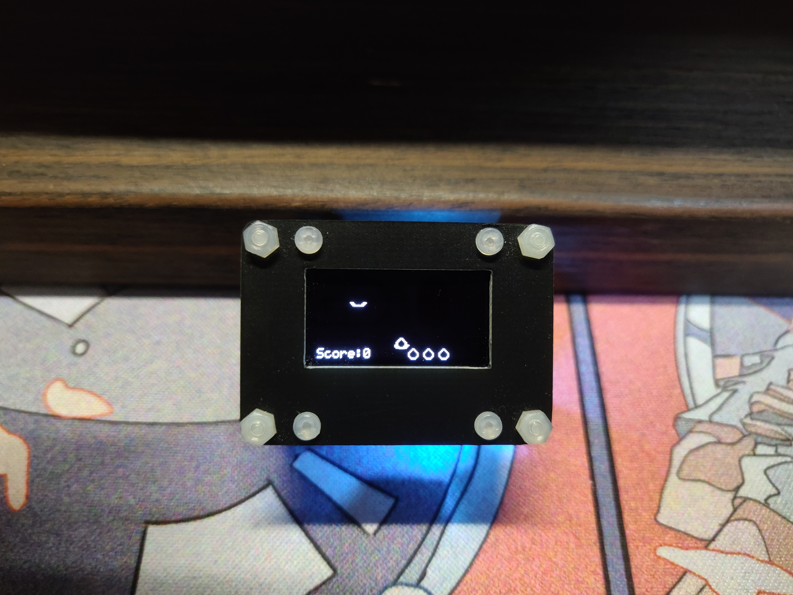
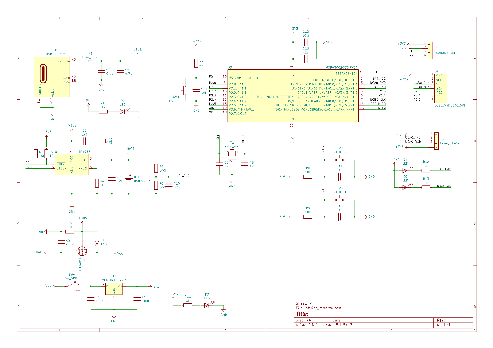
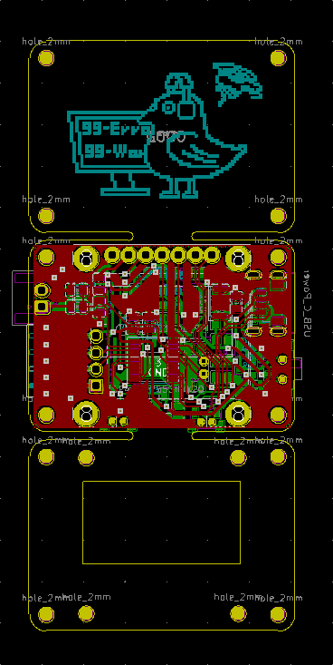
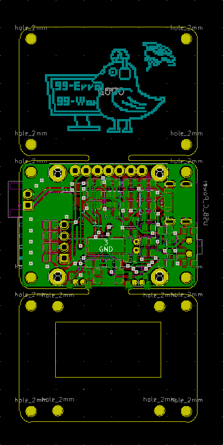

# 离线串口监视器
  
* [概括](#概括)
* [功能](#功能)
* [准备](#准备)
    - [材料清单](#材料清单)
    - [软件](#软件)
    - [硬件](#硬件)  
* [烧录](#烧录)
* [成品展示](#成品展示)
* [电路原理图](#电路原理图)
* [PCB](#PCB)  
* [魔改建议](#魔改建议)
* [一些使用](#一些使用)
* [外部链接](#外部链接)
* [更新日志](#更新日志)
## 概括
一个简易且毫无卵用的离线串口监视器(以下称监视器)，主控采用MSP430G2553，通过串口连接至目标串口，可以显示接收到的串口信息。
## 功能
#### 软件功能包含：  
1. 基本串口显示以及串口配置
2. 双路2.5V量程的10位ADC
3. 一个非常上瘾的小游戏  

#### 硬件包含:  
1. MSP430G2553最小系统
2. 基于TP4057的锂电池充电电路
3. USB/锂电池供电选择电路
4. 稳压电路
5. 基本的指示灯以及按键电路  
## 准备
### 材料清单
+ MSP430G2 LaunchPad
+ MSP430G2553
+ 0.96寸OLED
+ 锂电池
+ 一系列要用到的各种电阻、电容、按键、开关、稳压器、USB接口、晶振、排针等(具体可参考电路图)
+ 一块打好的PCB
+ 愿意焊板子的手
### 软件
该项目使用了[Code Composer Studio 10.2.0](https://www.ti.com.cn/tool/cn/CCSTUDIO)作为IDE  
其余版本的CCS未经证实，能成功导入工程一般就都可以编译烧录使用   
### 硬件
该项目使用了[MSP430G2 LaunchPad](https://www.ti.com.cn/tool/cn/MSP-EXP430G2)作为烧录器，新版的[MSP-EXP430G2ET LaunchPad](https://www.ti.com.cn/tool/cn/MSP-EXP430G2ET)不确定能否使用  
使用时需要拆除LaunchPad上的MSP430G2553并通过几条线连接到监视器上的MSP430G2553的debug接口  
如图所示  
   
## 烧录
在CCS中通过Project -> Import CCS Project...导入工程  
若提示导入失败，则勾选Copy projects into workspace  
在成功导入工程后，编译烧录即可  
烧录或者debug时建议断开监视器的电源，使用LaunchPad提供的电源  
成功启动后应该会显示如下界面
   
并会在TX脚以9600波特率输出以下信息
```
    Hello
    Offline Monitor
    V1.0
```
## 成品展示
### 串口监视器
  
### 串口配置
     
### ADC
   
### 内置小游戏
  
## 电路原理图
电路图如下图所示，包含最小系统、显示屏、充电、指示灯等等  
   
## PCB
PCB使用单板分割成三块板作为顶板底板的设计，免去做外壳的困扰~~其实是我不太会画3D模型外壳~~  
   
## 魔改建议
由于在完成这个工程时，MSP430的FLASH使用量已经达到13k(~80%)，RAM使用量也已经到400b(~80%)左右，MSP430G2553这个16k/512b的小身板所剩无几，所以后续各种新功能的添加都会导致整个系统的不稳定，比如乱码，ADC不显示啥的，所以真的需要魔改的话，建议删除不需要的功能比如删除小游戏再进行魔改
## 一些使用
魔改了一些中景园提供的OLED的驱动程序  
用了一些我学校里祖传的代码  
用了我自己的写的一个简易多级菜单(后续完善后会上传)  
## 外部链接
水了这个监视器的B站视频  
链接待补  
打算上传立创开源广场的PCB  
链接待补  
## 更新日志
### 1.0
```
2021年10月23日
可以使用了(其实已经在自己手里耍了小两个月了)
```

